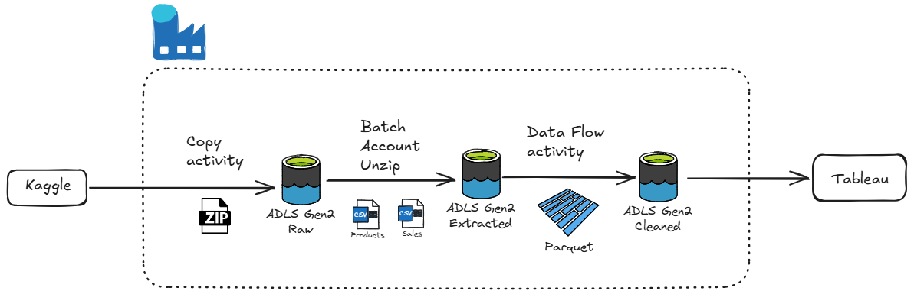
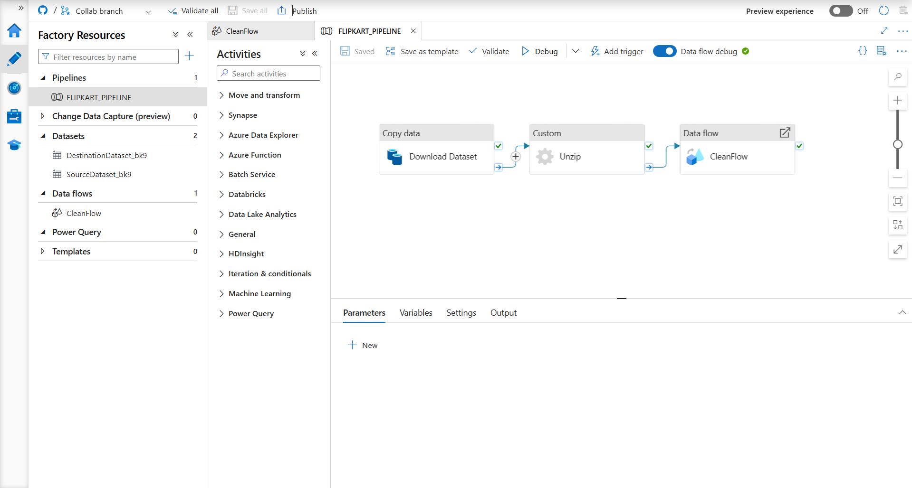
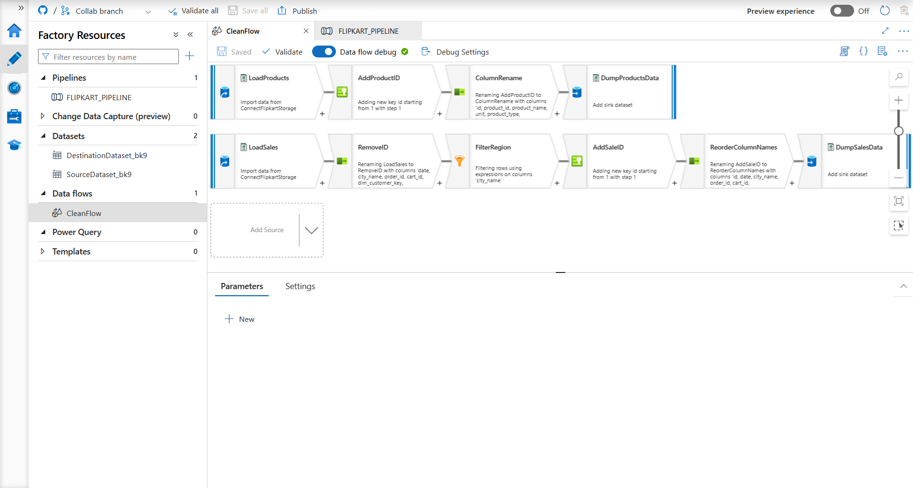
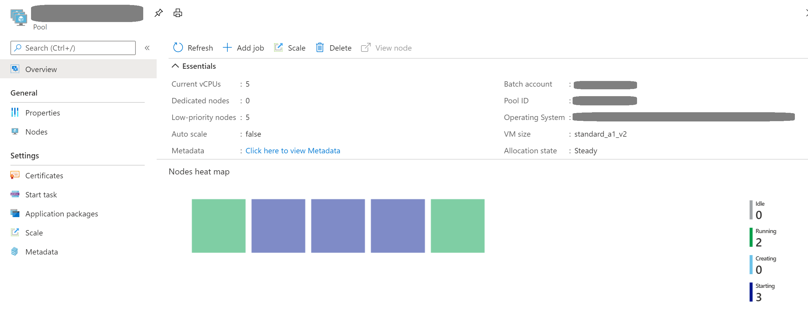
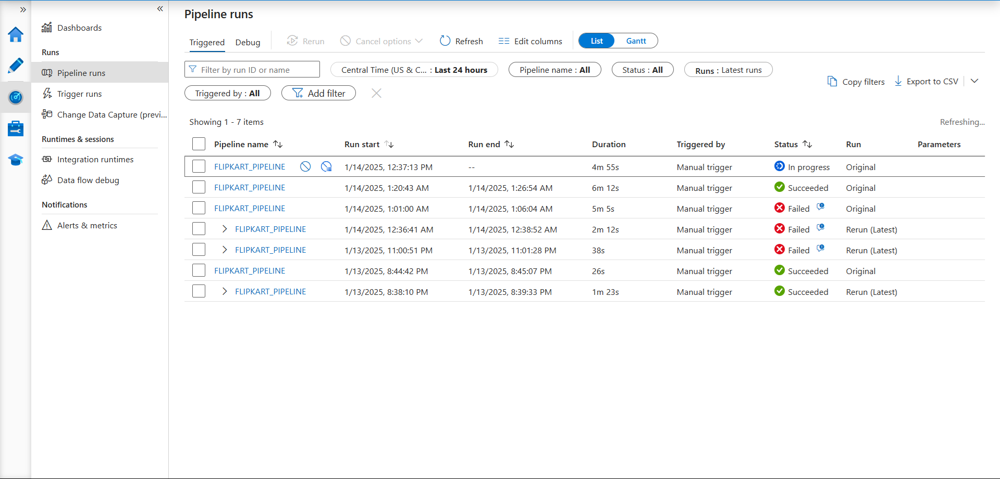
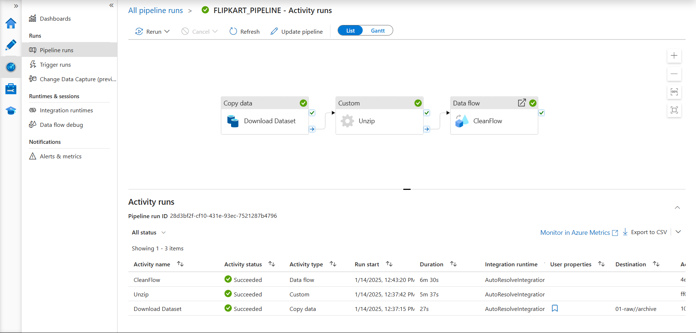
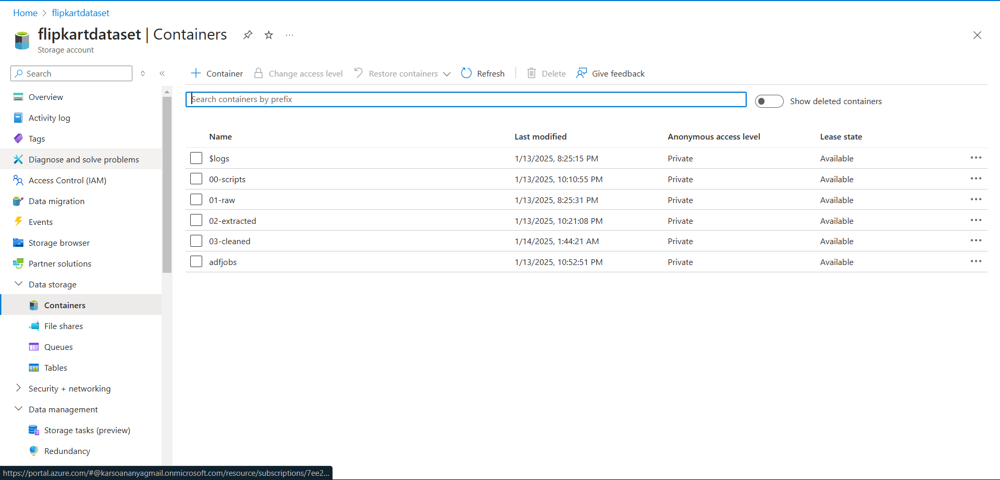

# Flipkart Data Processing

## Overview
Efficiently performed ELT (Extract, Load, Transform) operations on Flipkart sales data using Azure Data Factory (ADF) to streamline data processing and optimize performance.

## Process Workflow

1. **Data Ingestion**:
   - Used ADF's copy activity to ingest data into a landing Azure Data Lake Storage Gen2 (ADLS2).
   - Incoming data was in archive format. Since ADF supports unarchiving only single files from an archive, data was copied as a binary file.

2. **Data Extraction**:
   - Employed Custom Batch activities with 5 `standard_a1_v2` pools to efficiently unzip the large dataset (15.6 GB).
   - Successfully extracted two files using the import function with automatic mapping in ADF.

3. **Data Transformation**:
   - Utilized ADF's Data Flow for data cleaning:
     - Removed unnecessary columns.
     - Eliminated duplicate entries.
     - Handled null values effectively.
   - Added a surrogate key for unique identification.
   - Filtered data specific to the Delhi region.

4. **Optimization**:
   - Converted processed data into Parquet file format to reduce file size and enhance computational efficiency.

## Outcome
The optimized workflow significantly improved data processing speed and ensured a clean, regionalized dataset for further analysis.

# Screenshots

